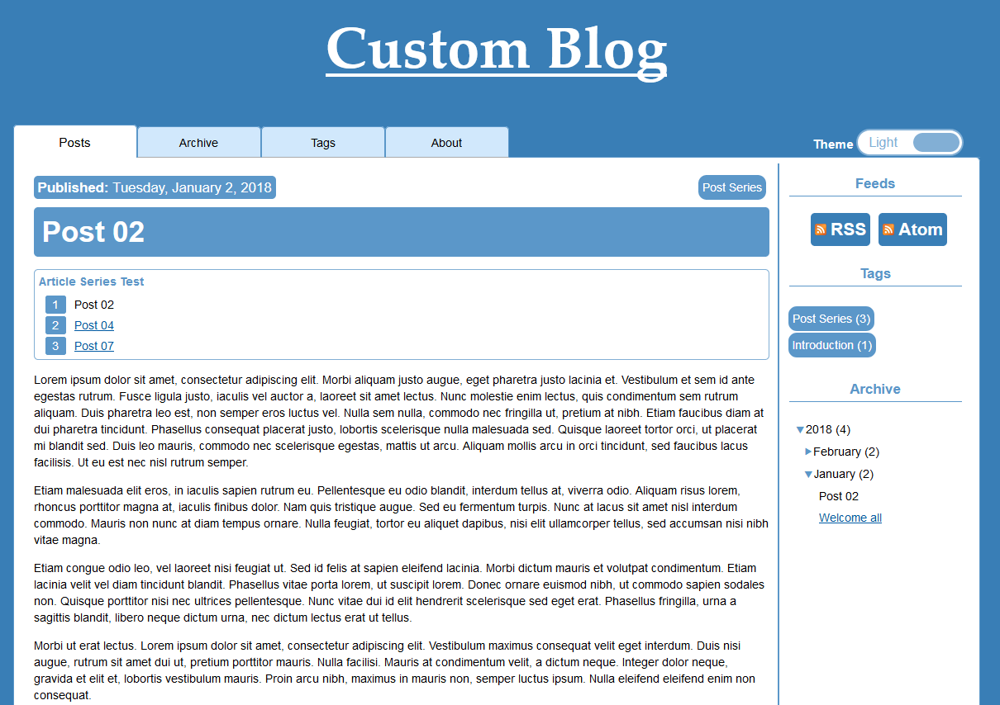

Showcase of markdown ([Markdig](https://github.com/lunet-io/markdig) flavour) elements

## Text + Horizontal rule

Lorem ipsum dolor sit amet, consectetur adipiscing elit. Morbi aliquam justo augue, eget pharetra justo lacinia et. Vestibulum et sem id ante egestas rutrum. Fusce ligula justo, iaculis vel auctor a, laoreet sit amet lectus. Nunc molestie enim lectus, quis condimentum sem rutrum aliquam. Duis pharetra leo est, non semper eros luctus vel. Nulla sem nulla, commodo nec fringilla ut, pretium at nibh. Etiam faucibus diam at dui pharetra tincidunt. Phasellus consequat placerat justo, lobortis scelerisque nulla malesuada sed. Quisque laoreet tortor orci, ut placerat mi blandit sed. Duis leo mauris, commodo nec scelerisque egestas, mattis ut arcu. Aliquam mollis arcu in orci tincidunt, sed faucibus lacus facilisis. Ut eu est nec nisl rutrum semper.

------------------------------------------------------

Etiam malesuada elit eros, in iaculis sapien rutrum eu. Pellentesque eu odio blandit, interdum tellus at, viverra odio. Aliquam risus lorem, rhoncus porttitor magna at, iaculis finibus dolor. Nam quis tristique augue. Sed eu fermentum turpis. Nunc at lacus sit amet nisl interdum commodo. Mauris non nunc at diam tempus ornare. Nulla feugiat, tortor eu aliquet dapibus, nisi elit ullamcorper tellus, sed accumsan nisi nibh vitae magna.


##  Titles

# Title 01
## Title 02
### Title 03
#### Title 04


## Image + Note

```MD
^^^

^^^ A screenshot of the blog.
```

^^^

^^^ A screenshot of the blog.


## Table

Right | Left | Default | Center
-----:|:-----|---------|:-----:
12    | 12   | 12      | 12
123   | 123  | 123     | 123
1     | 1    | 1       | 1


## Unordered list

 - Element 01
 - Element 02
    - Sub Element 01
    - Sub Element 02
    - Sub Element 03
        - Sub Sub Element 01
        - Sub Sub Element 02
    - Sub Element 04
 - Element 03
 - Element 04


## Ordered list

 1. Element 01
 2. Element 02
    1. Sub Element 01
    2. Sub Element 02
    3. Sub Element 03
        1. Sub Sub Element 01
        2. Sub Sub Element 02
    4. Sub Element 04
 3. Element 03
 4. Element 04


## Code

```CSS
.content cite:after {
    padding: .2em;
    padding-right: .3em;
    background-color: var(--cite); 
    border-radius: 3px;
    content: "”";
    font-weight: 900;
}
```


## Extra Emphasis and other formats

```MD
- ~~strike through~~ 
- ~subscript~ 
- ^superscript^ 
- ++inserted++ 
- ==marked== 
- ""This is a cite""
```

 - ~~strike through~~ 
 - ~subscript~ 
 - ^superscript^ 
 - ++inserted++ 
 - ==marked== 
 - ""This is a cite""


## Custom Containers

```MD
:::{.alert .alert-info}
A info alert.
:::
:::{.alert .alert-success}
A success alert.
:::
:::{.alert .alert-warning}
A warning alert.
:::
:::{.alert .alert-danger}
A danger alert.
:::
```

:::{.alert .alert-info}
A info alert.
:::

:::{.alert .alert-success}
A success alert.
:::

:::{.alert .alert-warning}
A warning alert.
:::

:::{.alert .alert-danger}
A danger alert.
:::


## Blockquote

```MD
> Whose woods these are I think I know.
>
> He will not see me stopping here
>
> To watch his woods fill up with snow.
>
> ^^ Robert Frost
```

> Whose woods these are I think I know.
>
> He will not see me stopping here
>
> To watch his woods fill up with snow.
>
> ^^ Robert Frost


## Definition Lists

```MD
Static Web Page
:   A static web page (sometimes called a flat page/stationary page) is a web page that is delivered to the user exactly as stored, in contrast to dynamic web pages which are generated by a web application. 

Wyam
:   It's a static content toolkit and can be used to generate web sites, produce documentation, create e-books, and much more

```

Static Web Page
:   A static web page (sometimes called a flat page/stationary page) is a web page that is delivered to the user exactly 
    as stored, in contrast to dynamic web pages which are generated by a web application. 

Wyam
:   It's a static content toolkit and can be used to generate web sites, produce documentation, create e-books, and much more


## Abbreviations

```MD
*[HTML]: Hypertext Mark-up Language
*[CSS]: Cascade Style Sheet
*[JS]: JavaScript 

This blog is build using only HTML, CSS and JS
```

*[HTML]: Hypertext Mark-up Language
*[CSS]: Cascade Style Sheet
*[JS]: JavaScript 

This blog is build using only HTML, CSS and JS